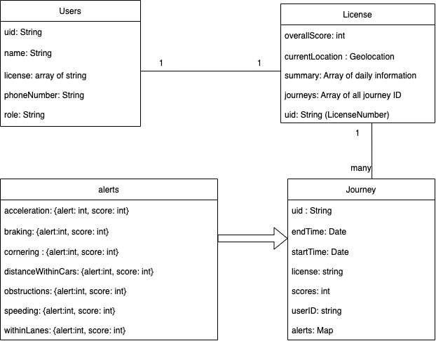

# Handover doc

*There are two parts. Part A is about installed packages. Part B is about some simple explanation of pages. Part C is about the backend, which is mainly about Firebase. For further questions, please contact me~*

## Part A:

1. Installed packages
   1. For checking all installed packages
   

```
npm ls --depth=0
```

2. For connecting Firebase:

   1. @react-native-firebase/app@15.4.0
   2. expo-firebase-recaptcha@2.3.0
   3. firebase@9.6.11

3. For Navigation:

   1. @react-navigation/native@6.0.12

4. For image picker about changing the profile photo:

   1. expo-image-picker@13.3.1

5. For time count down:

   1.  react-native-countdown-circle-timer@3.0.9

6. For calendar view:

   1. date-fns@2.29.3
   2. react-native-calendars@1.1290.0
   3.  react-native-daterange-picker@1.5.1
   4. react-native-week-month-date-picker@0.3.0
   5.  react-native-modern-datepicker@1.0.0-beta.91

7. Dropdown box:

   1. react-native-element-dropdown@2.3.0
   2. Possible used icons:
      1.react-native-elements@3.4.2
      2. react-native-vector-icons@9.2.0 (Ant design)

8. Google Maps View:

   1. react-native-maps@1.3.1
   2. react-native-maps-directions@1.9.0

9. Image swiper:

   1. react-native-swiper@1.6.0-rc.3
   2.  react-native-image-slider-box@2.0.6

10. Video player:

    1. expo-video-player@2.2.0
    2. expo-av@12.0.4

11. Modal

    1. react-native-modal@13.0.1

12.  view：

    1. safe area view：react-native-safe-area-context@4.3.4
    2. web view：react-native-webview@11.23.1

13. donut pie chart

    1. react-native-svg@12.3.0

    2. react-native-svg-charts@5.4.0

    3. react-native-reanimated@2.9.1

       

## Part B 

Others are easy to understand by the naming of the file. Only listed the complicated ones:

1. Component: Calendar View 
   1. [Calendar Component](./components/UI/CalnedarButton.js)
      1. [WeekSelection+DaySelection](../components/UI/Calendar.js)
      2. [YearSelection](../components/UI/CalendarB.js)
2. Component: [Controller](../components/ManageUders/Controller.js)
   1. It will fetch the backend data to list the selected journey's alert information, which includes 7 types of alerts. Each alert is rendered in [component_alertCard](../components/UI/AlertCard.js)
3. Component: [ScoreBoard](../components/UI/ScoreBoard.js)
   1. This component will list all. 
4. Page: Edit Profile 
   1. [Component_Profile](../components/UI/Profile.js)
      1. This will list the driver's personal information by using the input component to display each row, such as name and phone.

## Part C

1. The firebase connection is settled in the [firebase.js](/firebase.js)

2. Table structures

   1. Assumes one license only related to one driver/ user for now.

   


